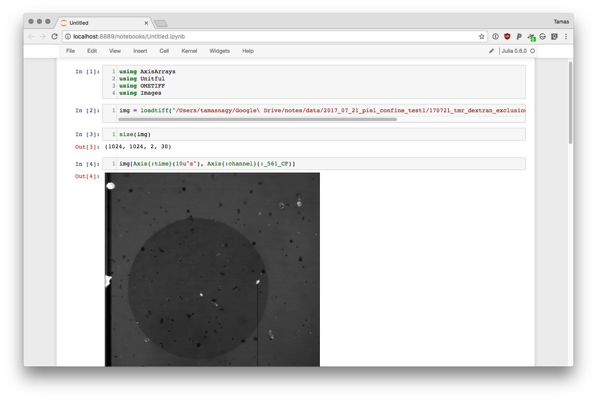

# OMETIFF.jl

[](https://travis-ci.org/tlnagy/OMETIFF.jl)
[](http://codecov.io/github/tlnagy/OMETIFF.jl?branch=master)

Adds support for reading OME-TIFF files to the [Images.jl](https://github.com/JuliaImages/Images.jl)
platform. Allows fast and easy interfacing with high-dimensional data with nice
labeled axes provided by [AxisArrays.jl](https://github.com/JuliaImages/AxisArrays.jl).



## Usage

```julia
using OMETIFF
img = loadtiff("path/to/ome.tif")
println(axisnames(img))
println(axisvalues(img))
```

```
(:y, :x, :channel, :time)
(1:1024, 1:1024, Symbol[:_561_CF, :Conf_DIA], 0.0 ms:10000.0 ms:290000.0 ms)
```
